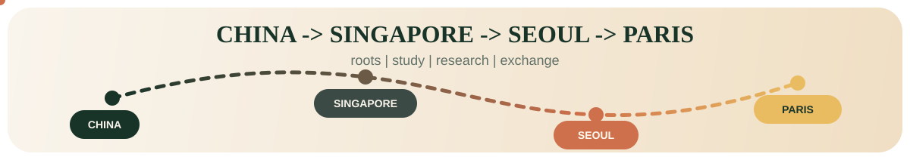

  

  
  
  
  

  

**Data Science & AI @ NTU** • **Researcher** • **Interface Builder**

*Exploring temporal knowledge graphs, medical-imaging automation, and financial signals.*

 

### ❖ Highlights

**SLB:** Automated document verification with Azure AI Search (⬇ 70% multimodal calls, ⬇ 50% processing cost)  
**ASEE 2025:** Published [research on AI Literacy, Trust, & Ethical Decision-Making](https://peer.asee.org/55858) 

 

### ❖ Stack

  
  
  
  
  
  
  
  
  
  
  
  
  
  
  
  
  
  
  
  

 

  
  
  

EN • 中文 • FR 

